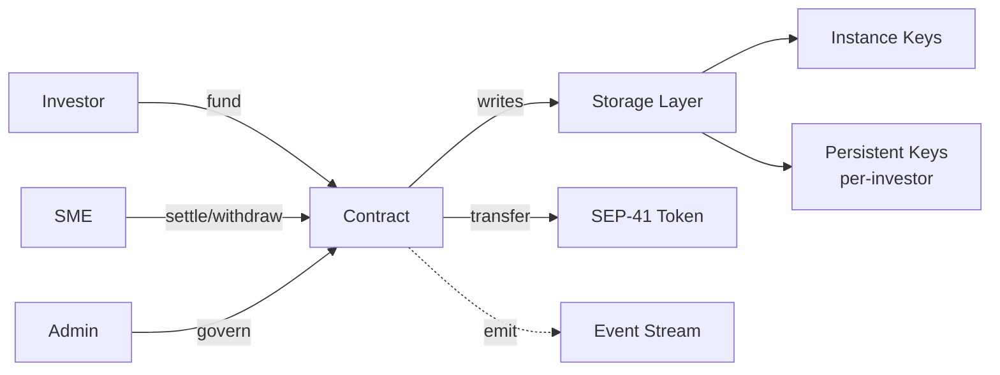

# Data Flow

Authorization, storage, and token movement paths.

## Flow Phases

### 1. Authorization
- **Investor**: Calls `fund()` / `fund_with_commitment()`
- **SME**: Calls `withdraw()` / `settle()`
- **Admin**: Calls governance functions (legal hold, migration, etc.)
- **Treasury**: Calls `sweep_terminal_dust()`

### 2. Storage Write
- **Instance keys**: Atomic escrow state, version, legal hold
- **Persistent keys**: Per-investor contributions, yields, claims

### 3. Token Transfer
All transfers route through `external_calls::transfer_token_from()`:
- Pre-transfer balance check (no balance assumption)
- Post-transfer equality verification (rejects fee-on-transfer)
- Typed error codes on mismatch (codes 36–41)

### 4. Event Emission
- State changes emit typed events (e.g., `EscrowFunded`, `EscrowSettled`)
- Indexed by role and ledger height for off-chain auditing
