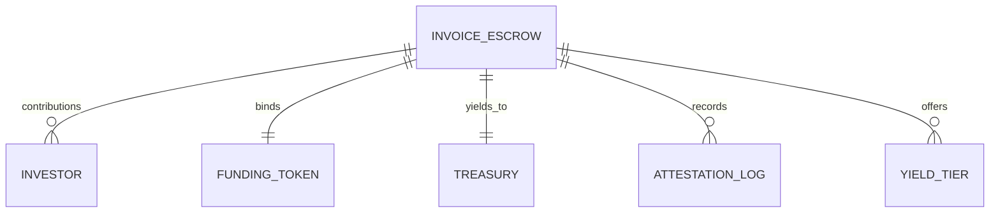

# Entity Relationships

Data model and storage associations.

## Entities

- **INVOICE_ESCROW**: Root state containing escrow metadata, amounts, and status
- **INVESTOR**: Per-address contribution records (persistent storage)
- **FUNDING_TOKEN**: Immutable SEP-41 token contract reference
- **TREASURY**: Immutable recipient for dust sweep operations
- **ATTESTATION_LOG**: Audit chain of approval digests
- **YIELD_TIER**: Optional commitment-based yield ladder

## Relationships

1. **One-to-Many (investors)**: Each escrow accepts multiple investor contributions
2. **One-to-One (token/treasury)**: Immutable bindings at initialization
3. **Append-only (attestations)**: Bounded audit log with per-entry revocation markers
