# Entrypoint Matrix

Role-based API surface.

```mermaid
graph LR
    ADMIN["ADMIN"] --> get_pending_admin["💬 get_pending_admin()"]
    ADMIN["ADMIN"] --> verify_asset_custody["💬 verify_asset_custody()"]
    ADMIN["ADMIN"] --> get_max_unique_investors_cap["💬 get_max_unique_investors_cap()"]
    ADMIN["ADMIN"] --> set_legal_hold["💬 set_legal_hold()"]
    ADMIN["ADMIN"] --> partial_settle["💬 partial_settle()"]
    ADMIN["ADMIN"] --> propose_admin["💬 propose_admin()"]
    ADMIN["ADMIN"] --> accept_admin["💬 accept_admin()"]
    ADMIN["ADMIN"] --> transfer_admin["💬 transfer_admin()"]
    INVESTOR["INVESTOR"] --> get_min_contribution_floor["💬 get_min_contribution_floor()"]
    INVESTOR["INVESTOR"] --> get_max_per_investor_cap["💬 get_max_per_investor_cap()"]
    INVESTOR["INVESTOR"] --> get_contribution["💬 get_contribution()"]
    INVESTOR["INVESTOR"] --> get_investor_yield_bps["💬 get_investor_yield_bps()"]
    INVESTOR["INVESTOR"] --> get_investor_claim_not_before["💬 get_investor_claim_not_before()"]
    INVESTOR["INVESTOR"] --> get_yield_slippage_threshold["💬 get_yield_slippage_threshold()"]
    INVESTOR["INVESTOR"] --> get_investor_yield_slippage["💬 get_investor_yield_slippage()"]
    INVESTOR["INVESTOR"] --> set_allowlist_active["💬 set_allowlist_active()"]
    INVESTOR["INVESTOR"] --> set_investor_allowlisted["💬 set_investor_allowlisted()"]
    INVESTOR["INVESTOR"] --> set_investors_allowlisted["💬 set_investors_allowlisted()"]
    INVESTOR["INVESTOR"] --> lower_max_unique_investors["💬 lower_max_unique_investors()"]
    INVESTOR["INVESTOR"] --> fund_with_commitment["💬 fund_with_commitment()"]
    INVESTOR["INVESTOR"] --> claim_investor_payout["💬 claim_investor_payout()"]
    INVESTOR["INVESTOR"] --> cancel_funding["💬 cancel_funding()"]
    INVESTOR["INVESTOR"] --> refund["💬 refund()"]
    INVESTOR["INVESTOR"] --> is_investor_refunded["💬 is_investor_refunded()"]
    INVESTOR["INVESTOR"] --> get_distributed_principal["💬 get_distributed_principal()"]
    PUBLIC["PUBLIC"] --> new["💬 new()"]
    PUBLIC["PUBLIC"] --> with_context["💬 with_context()"]
    PUBLIC["PUBLIC"] --> init["💬 init()"]
    PUBLIC["PUBLIC"] --> get_funding_token["💬 get_funding_token()"]
    PUBLIC["PUBLIC"] --> get_registry_ref["💬 get_registry_ref()"]
    PUBLIC["PUBLIC"] --> sweep_terminal_dust["💬 sweep_terminal_dust()"]
    PUBLIC["PUBLIC"] --> get_escrow["💬 get_escrow()"]
    PUBLIC["PUBLIC"] --> get_version["💬 get_version()"]
    PUBLIC["PUBLIC"] --> get_interface_version["💬 get_interface_version()"]
    PUBLIC["PUBLIC"] --> get_funding_deadline["💬 get_funding_deadline()"]
    PUBLIC["PUBLIC"] --> is_funding_expired["💬 is_funding_expired()"]
    PUBLIC["PUBLIC"] --> get_legal_hold["💬 get_legal_hold()"]
    PUBLIC["PUBLIC"] --> get_legal_hold_clear_delay["💬 get_legal_hold_clear_delay()"]
    PUBLIC["PUBLIC"] --> get_legal_hold_clearable_at["💬 get_legal_hold_clearable_at()"]
    PUBLIC["PUBLIC"] --> get_unique_funder_count["💬 get_unique_funder_count()"]
    PUBLIC["PUBLIC"] --> get_escrow_summary["💬 get_escrow_summary()"]
    PUBLIC["PUBLIC"] --> bind_primary_attestation_hash["💬 bind_primary_attestation_hash()"]
    PUBLIC["PUBLIC"] --> get_primary_attestation_hash["💬 get_primary_attestation_hash()"]
    PUBLIC["PUBLIC"] --> append_attestation_digest["💬 append_attestation_digest()"]
    PUBLIC["PUBLIC"] --> get_attestation_append_log["💬 get_attestation_append_log()"]
    PUBLIC["PUBLIC"] --> get_funding_close_snapshot["💬 get_funding_close_snapshot()"]
    PUBLIC["PUBLIC"] --> revoke_attestation_digest["💬 revoke_attestation_digest()"]
    PUBLIC["PUBLIC"] --> is_attestation_revoked["💬 is_attestation_revoked()"]
    PUBLIC["PUBLIC"] --> is_investor_claimed["💬 is_investor_claimed()"]
    PUBLIC["PUBLIC"] --> request_clear_legal_hold["💬 request_clear_legal_hold()"]
    PUBLIC["PUBLIC"] --> is_allowlist_active["💬 is_allowlist_active()"]
    PUBLIC["PUBLIC"] --> is_investor_allowlisted["💬 is_investor_allowlisted()"]
    PUBLIC["PUBLIC"] --> clear_legal_hold["💬 clear_legal_hold()"]
    PUBLIC["PUBLIC"] --> update_funding_target["💬 update_funding_target()"]
    PUBLIC["PUBLIC"] --> migrate["💬 migrate()"]
    PUBLIC["PUBLIC"] --> upgrade["💬 upgrade()"]
    PUBLIC["PUBLIC"] --> fund["💬 fund()"]
    PUBLIC["PUBLIC"] --> settle["💬 settle()"]
    PUBLIC["PUBLIC"] --> withdraw["💬 withdraw()"]
    PUBLIC["PUBLIC"] --> compute_investor_payout["💬 compute_investor_payout()"]
    PUBLIC["PUBLIC"] --> update_maturity["💬 update_maturity()"]
    PUBLIC["PUBLIC"] --> bump_ttl["💬 bump_ttl()"]
    SME["SME"] --> has_maturity_lock["💬 has_maturity_lock()"]
    SME["SME"] --> rotate_beneficiary["💬 rotate_beneficiary()"]
    SME["SME"] --> get_sme_collateral_commitment["💬 get_sme_collateral_commitment()"]
    SME["SME"] --> record_sme_collateral_commitment["💬 record_sme_collateral_commitment()"]
    TREASURY["TREASURY"] --> get_treasury["💬 get_treasury()"]
```

## Entrypoints by Role

### Admin
- `init()` — Initialize escrow
- `set_legal_hold()` — Compliance gate
- `propose_admin()` / `accept_admin()` — Admin handover
- `bind_primary_attestation_hash()` — Digest binding
- `record_sme_collateral_commitment()` — Metadata

### SME
- `withdraw()` — Pull funded amount
- `settle()` — Finalize settlement
- `record_sme_collateral_commitment()` — Report collateral

### Investor
- `fund()` — Contribute principal
- `fund_with_commitment()` — Lock + tier selection
- `claim_investor_payout()` — Claim after settlement
- `refund()` — Reclaim in cancelled escrow

### Treasury
- `sweep_terminal_dust()` — Terminal rounding cleanup

### Public (No Auth)
- `get_escrow()` — Read state
- `get_version()` — Read schema version
- `get_template()` — Template lookup

## Authorization Guard Ordering

Every state mutation:
1. Read-only preconditions (legal hold, status, input validation)
2. `Address::require_auth()` for the bound role
3. Storage writes + SEP-41 transfers
