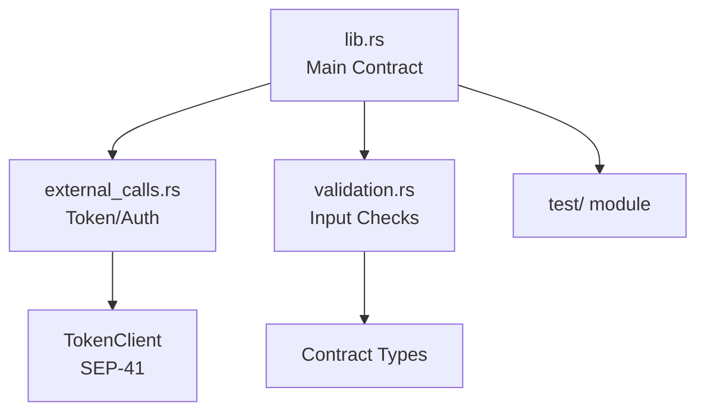

# Module Structure

Code organization and internal dependencies.

## Modules

### `lib.rs` (Main Contract)
- **Responsibility**: Public API, state machine, auth boundaries
- **Key items**: `LiquifactEscrow` impl, `DataKey` enum, `InvoiceEscrow` struct
- **Lines**: ~3300 LOC (including tests)

### `external_calls.rs`
- **Responsibility**: Token transfers and Stellar authorization
- **Key items**: `transfer_token_from()`, balance equality checks
- **Boundary**: SEP-41 compliance verification, typed errors 36–41

### `validation.rs`
- **Responsibility**: Input validation and preconditions
- **Key items**: Invoice ID charset, amount bounds, maturity checks
- **Boundary**: Prevents invalid state before auth gates

## Dependencies

- **soroban-sdk**: Core contract runtime, storage, types
- **soroban-auth**: Authorization delegation (if used)
- **serde/serde_json**: Test fixtures and serialization
