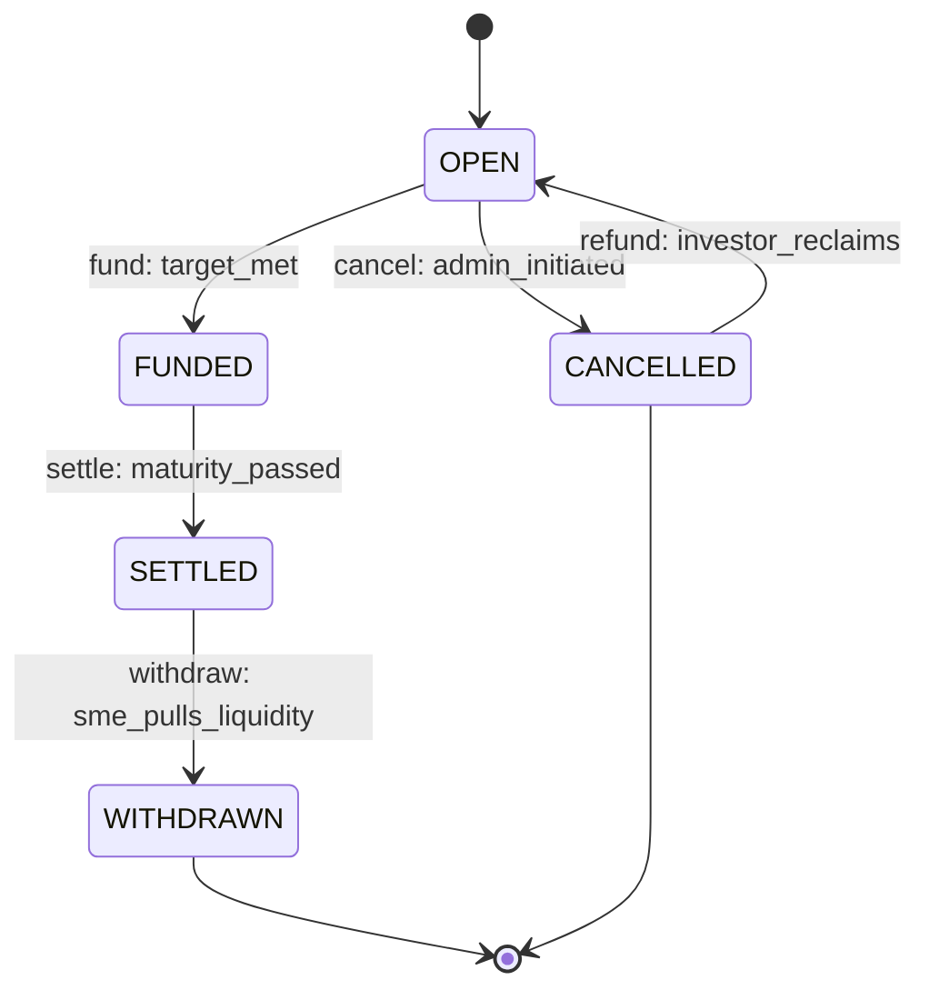

# State Machine

Escrow lifecycle transitions (forward-only).

## Status Codes

| Code | Name | Meaning |
|------|------|---------|
| 0 | OPEN | Initial; accepting contributions |
| 1 | FUNDED | Funding target reached; awaiting settlement |
| 2 | SETTLED | Settlement locked in; no investor claims |
| 3 | WITHDRAWN | SME pulled liquidity; awaiting investor claims |
| 4 | CANCELLED | Admin halt; investors may refund |

## Transitions

- **0 → 1**: `fund()` reaches `funding_target`
- **1 → 2**: `settle()` called after maturity
- **2 → 3**: `withdraw()` called by SME (after settle)
- **0 → 4**: `cancel_escrow()` called by admin
- **4 → —**: Investors call `refund()` to reclaim principal

## Legal Hold Impact

Legal hold blocks:
- Settlement finalization (1 → 2)
- SME withdrawal (2 → 3)
- Investor claim payouts
- Does **not** block admin authority or hold clearance
