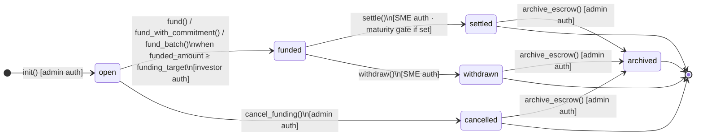
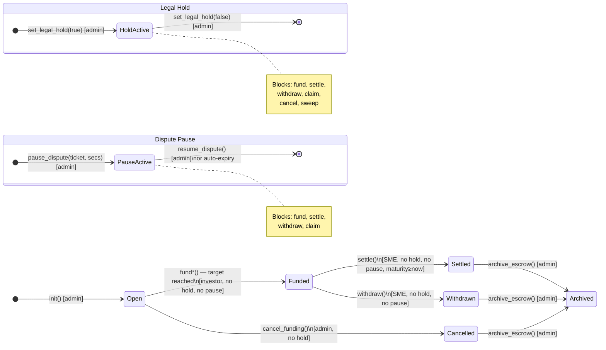
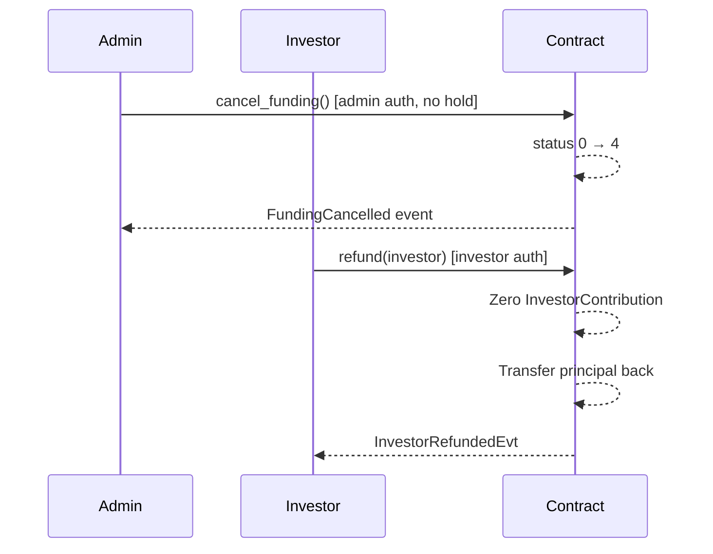

# karis-ky Escrow State Machine

This document provides the authoritative Mermaid state diagram for the `InvoiceEscrow.status`
field, clearly labelling every blocked operation per state, and showing the legal hold and
dispute pause overlays as distinct cross-cutting concerns.

> **Source of truth:** `escrow/src/lib.rs` — `InvoiceEscrow.status` and the `EscrowError`
> variants `LegalHoldBlocks*` / `DisputePausedBlocks*`.

---

## Status values

| Code | Name | Description |
|------|------|-------------|
| `0` | **open** | Escrow initialized; funding is active |
| `1` | **funded** | `funded_amount >= funding_target`; awaiting settlement |
| `2` | **settled** | SME finalized settlement via `settle()` |
| `3` | **withdrawn** | SME pulled liquidity via `withdraw()` |
| `4` | **cancelled** | Admin cancelled before funding; investors may `refund()` |
| `5` | **archived** | Admin archived a terminal escrow; read-only |

---

## Core state diagram



---

## Operations blocked per state

### State 0 — open

| Operation | Allowed | Notes |
|-----------|---------|-------|
| `fund` / `fund_with_commitment` / `fund_batch` | ✅ Yes | Blocked by legal hold or dispute pause |
| `cancel_funding` | ✅ Yes | Blocked by legal hold |
| `settle` | ❌ No | `EscrowError::SettlementNotFunded` (121) |
| `withdraw` | ❌ No | `EscrowError::WithdrawalNotFunded` (124) |
| `claim_investor_payout` | ❌ No | `EscrowError::InvestorClaimNotSettled` (127) |
| `refund` | ❌ No | `EscrowError::RefundNotCancelled` (142) |
| `sweep_terminal_dust` | ❌ No | `EscrowError::DustSweepNotTerminal` (33) |
| `archive_escrow` | ❌ No | `EscrowError::ArchiveNotTerminal` |

### State 1 — funded

| Operation | Allowed | Notes |
|-----------|---------|-------|
| `fund` / `fund_with_commitment` | ❌ No | `EscrowError::EscrowNotOpenForFunding` (103) |
| `settle` | ✅ Yes | Blocked by legal hold, dispute pause; maturity gate applies |
| `withdraw` | ✅ Yes | Blocked by legal hold, dispute pause |
| `claim_investor_payout` | ❌ No | `EscrowError::InvestorClaimNotSettled` (127) — escrow must be status 2 |
| `cancel_funding` | ❌ No | `EscrowError::CancelFundingNotOpen` (141) |
| `refund` | ❌ No | `EscrowError::RefundNotCancelled` (142) |
| `sweep_terminal_dust` | ❌ No | `EscrowError::DustSweepNotTerminal` (33) |
| `archive_escrow` | ❌ No | `EscrowError::ArchiveNotTerminal` |

### State 2 — settled

| Operation | Allowed | Notes |
|-----------|---------|-------|
| `claim_investor_payout` | ✅ Yes | Blocked by legal hold, dispute pause; commitment lock gate applies |
| `settle` | ❌ No | `EscrowError::SettlementNotFunded` (121) |
| `withdraw` | ❌ No | `EscrowError::WithdrawalNotFunded` (124) |
| `sweep_terminal_dust` | ✅ Yes | Blocked by legal hold; treasury auth required |
| `archive_escrow` | ✅ Yes | Admin auth required |

### State 3 — withdrawn

| Operation | Allowed | Notes |
|-----------|---------|-------|
| `settle` | ❌ No | `EscrowError::SettlementNotFunded` (121) |
| `withdraw` | ❌ No | `EscrowError::WithdrawalNotFunded` (124) |
| `sweep_terminal_dust` | ✅ Yes | Blocked by legal hold; treasury auth required |
| `archive_escrow` | ✅ Yes | Admin auth required |

### State 4 — cancelled

| Operation | Allowed | Notes |
|-----------|---------|-------|
| `refund` | ✅ Yes | Per investor; blocked if escrow is paused |
| `sweep_terminal_dust` | ✅ Yes | Blocked by legal hold; liability floor enforced; treasury auth required |
| `cancel_funding` | ❌ No | `EscrowError::CancelFundingNotOpen` (141) |
| `fund` | ❌ No | `EscrowError::EscrowNotOpenForFunding` (103) |
| `settle` / `withdraw` | ❌ No | `EscrowError::SettlementNotFunded` / `WithdrawalNotFunded` |
| `archive_escrow` | ✅ Yes | Admin auth required |

### State 5 — archived

All state-mutating operations are blocked. Read-only entrypoints (`get_escrow`,
`get_escrow_summary`, `compute_investor_payout`, etc.) remain accessible.

---

## Legal hold overlay

Legal hold (`DataKey::LegalHold = true`) is a cross-cutting compliance freeze set and
cleared by the current admin. It does **not** change `status`; it overlays the existing state.

```mermaid
stateDiagram-v2
    direction TB

    state "Any state (0–5)" as any

    state "LEGAL HOLD ACTIVE" as hold {
        direction LR
        note right of hold
            Blocked entrypoints:
            • fund / fund_with_commitment / fund_batch → EscrowError 102
            • settle → EscrowError 120
            • withdraw → EscrowError 123
            • claim_investor_payout → EscrowError 125
            • cancel_funding → EscrowError 140
            • sweep_terminal_dust → EscrowError 30

            NOT blocked:
            • propose_admin / accept_admin (recovery path)
            • All read-only entrypoints
        end note
    }

    any --> hold : set_legal_hold(true) [admin]
    hold --> any : set_legal_hold(false) [admin]\nafter request_clear_legal_hold() if delay > 0
```

**Recovery when admin key is lost:** use `propose_admin` (current admin) and `accept_admin`
(successor) to rotate admin, then clear the hold. Neither `propose_admin` nor `accept_admin`
is gated by the legal hold.

---

## Dispute pause overlay

Dispute pause (`DataKey::DisputePaused`) is a temporary, auto-expiring freeze triggered by
the admin for dispute resolution (e.g., invoice validity challenge). It is **separate** from
legal hold and can coexist with it.

```mermaid
stateDiagram-v2
    direction TB

    state "Any state (0–4)" as any

    state "DISPUTE PAUSE ACTIVE" as pause {
        direction LR
        note right of pause
            Blocked entrypoints:
            • fund / fund_with_commitment / fund_batch → EscrowError 165
            • settle → EscrowError 166
            • withdraw → EscrowError 167
            • claim_investor_payout → EscrowError 168

            NOT blocked:
            • cancel_funding
            • sweep_terminal_dust (only blocked by legal hold)
            • refund
            • All read-only entrypoints

            Auto-expires: when ledger.timestamp() ≥ expires_at
        end note
    }

    any --> pause : pause_dispute(ticket_id, duration_secs)\n[admin auth]
    pause --> any : resume_dispute() [admin auth]\nor auto-expiration (ledger time ≥ expires_at)
```

---

## Combined state + legal hold + dispute pause diagram

This diagram shows all states and both cross-cutting overlays together.



---

## Transition table

| From | To | Trigger | Auth | Blocked by |
|------|----|---------|------|------------|
| 0 → open | 1 → funded | `fund*()` when `funded_amount ≥ target` | Investor | Legal hold (102), Dispute pause (165) |
| 0 → open | 4 → cancelled | `cancel_funding()` | Admin | Legal hold (140) |
| 1 → funded | 2 → settled | `settle()` | SME | Legal hold (120), Dispute pause (166), Maturity gate (122) |
| 1 → funded | 3 → withdrawn | `withdraw()` | SME | Legal hold (123), Dispute pause (167) |
| 2, 3, 4 → terminal | 5 → archived | `archive_escrow()` | Admin | — |

### Forbidden transitions (always panic)

| Attempted | Error |
|-----------|-------|
| 0 → 2 or 0 → 3 | `SettlementNotFunded` / `WithdrawalNotFunded` |
| 1 → 0 (any regression) | `CancelFundingNotOpen` / not possible via API |
| 1 → 4 | `CancelFundingNotOpen` (141) |
| 2 → any | `SettlementNotFunded` / `WithdrawalNotFunded` |
| 3 → any | `SettlementNotFunded` / `WithdrawalNotFunded` |
| 4 → any except 5 | `CancelFundingNotOpen` / `RefundNotCancelled` etc. |
| 5 → any | All mutating calls fail (archived, read-only) |

---

## Mutual exclusivity: `settle` vs `withdraw`

Both `settle` and `withdraw` require `status == 1`. Once either succeeds:

- `settle()` → `status = 2`; subsequent `withdraw()` panics with `WithdrawalNotFunded (124)`.
- `withdraw()` → `status = 3`; subsequent `settle()` panics with `SettlementNotFunded (121)`.

---

## Investor refund path (cancelled escrow)



---

## Related documents

| Document | Description |
|----------|-------------|
| [`escrow-lifecycle.md`](escrow-lifecycle.md) | Narrative state machine reference with forbidden transitions |
| [`docs/adr/ADR-001-state-model.md`](adr/ADR-001-state-model.md) | Why status is a forward-only u32 |
| [`docs/adr/ADR-004-legal-hold.md`](adr/ADR-004-legal-hold.md) | Legal hold design and recovery path |
| [`escrow-legal-hold.md`](escrow-legal-hold.md) | Operational guidance for holds |
| [`OPERATOR_RUNBOOK.md`](OPERATOR_RUNBOOK.md) | Deployment and compliance runbook |
| [`DEPLOYER_SECURITY.md`](DEPLOYER_SECURITY.md) | Dispute pause operational guidance |
| [`escrow-error-messages.md`](escrow-error-messages.md) | All typed error codes (90–172) |
