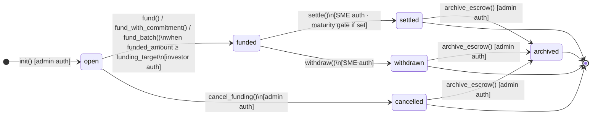
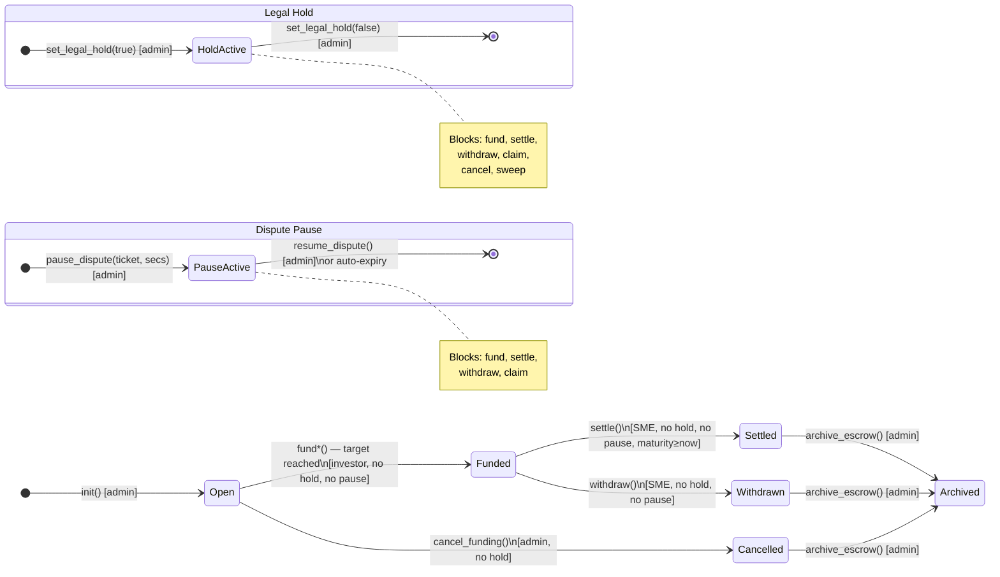
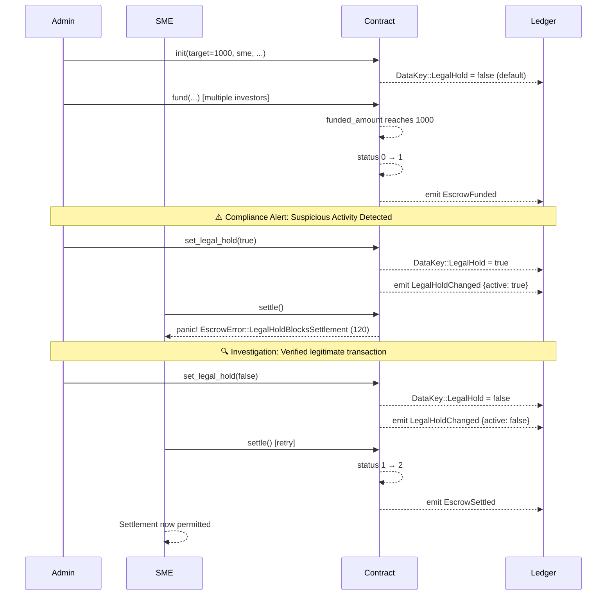
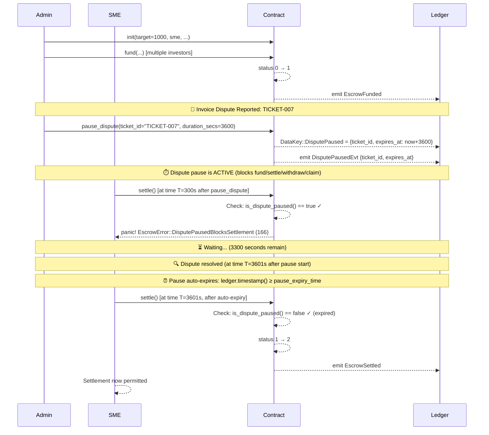
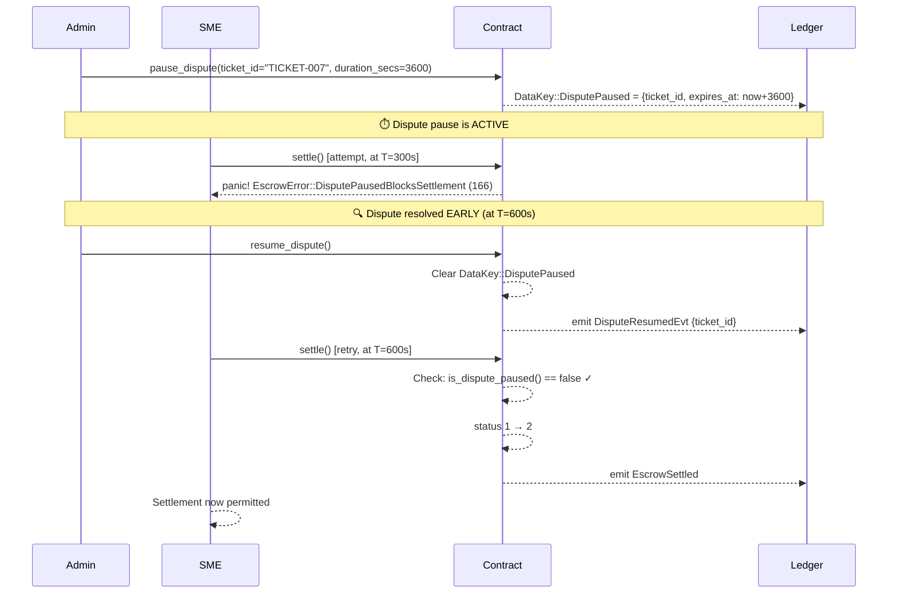
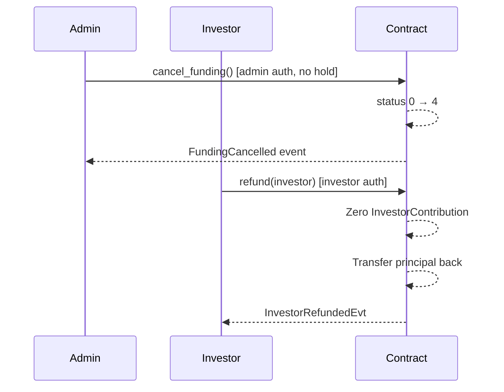

# karis-ky Escrow State Machine

This document provides the authoritative Mermaid state diagram for the `InvoiceEscrow.status`
field, clearly labelling every blocked operation per state, and showing the legal hold and
dispute pause overlays as distinct cross-cutting concerns.

> **Source of truth:** `escrow/src/lib.rs` — `InvoiceEscrow.status` and the `EscrowError`
> variants `LegalHoldBlocks*` / `DisputePausedBlocks*`.

---

## Status values

| Code | Name | Description |
|------|------|-------------|
| `0` | **open** | Escrow initialized; funding is active |
| `1` | **funded** | `funded_amount >= funding_target`; awaiting settlement |
| `2` | **settled** | SME finalized settlement via `settle()` |
| `3` | **withdrawn** | SME pulled liquidity via `withdraw()` |
| `4` | **cancelled** | Admin cancelled before funding; investors may `refund()` |
| `5` | **archived** | Admin archived a terminal escrow; read-only |

---

## Core state diagram



---

## Operations blocked per state

### State 0 — open

| Operation | Allowed | Notes |
|-----------|---------|-------|
| `fund` / `fund_with_commitment` / `fund_batch` | ✅ Yes | Blocked by legal hold or dispute pause |
| `cancel_funding` | ✅ Yes | Blocked by legal hold |
| `settle` | ❌ No | `EscrowError::SettlementNotFunded` (121) |
| `withdraw` | ❌ No | `EscrowError::WithdrawalNotFunded` (124) |
| `claim_investor_payout` | ❌ No | `EscrowError::InvestorClaimNotSettled` (127) |
| `refund` | ❌ No | `EscrowError::RefundNotCancelled` (142) |
| `sweep_terminal_dust` | ❌ No | `EscrowError::DustSweepNotTerminal` (33) |
| `archive_escrow` | ❌ No | `EscrowError::ArchiveNotTerminal` |

### State 1 — funded

| Operation | Allowed | Notes |
|-----------|---------|-------|
| `fund` / `fund_with_commitment` | ❌ No | `EscrowError::EscrowNotOpenForFunding` (103) |
| `settle` | ✅ Yes | Blocked by legal hold, dispute pause; maturity gate applies |
| `withdraw` | ✅ Yes | Blocked by legal hold, dispute pause |
| `claim_investor_payout` | ❌ No | `EscrowError::InvestorClaimNotSettled` (127) — escrow must be status 2 |
| `cancel_funding` | ❌ No | `EscrowError::CancelFundingNotOpen` (141) |
| `refund` | ❌ No | `EscrowError::RefundNotCancelled` (142) |
| `sweep_terminal_dust` | ❌ No | `EscrowError::DustSweepNotTerminal` (33) |
| `archive_escrow` | ❌ No | `EscrowError::ArchiveNotTerminal` |

### State 2 — settled

| Operation | Allowed | Notes |
|-----------|---------|-------|
| `claim_investor_payout` | ✅ Yes | Blocked by legal hold, dispute pause; commitment lock gate applies |
| `settle` | ❌ No | `EscrowError::SettlementNotFunded` (121) |
| `withdraw` | ❌ No | `EscrowError::WithdrawalNotFunded` (124) |
| `sweep_terminal_dust` | ✅ Yes | Blocked by legal hold; treasury auth required |
| `archive_escrow` | ✅ Yes | Admin auth required |

### State 3 — withdrawn

| Operation | Allowed | Notes |
|-----------|---------|-------|
| `settle` | ❌ No | `EscrowError::SettlementNotFunded` (121) |
| `withdraw` | ❌ No | `EscrowError::WithdrawalNotFunded` (124) |
| `sweep_terminal_dust` | ✅ Yes | Blocked by legal hold; treasury auth required |
| `archive_escrow` | ✅ Yes | Admin auth required |

### State 4 — cancelled

| Operation | Allowed | Notes |
|-----------|---------|-------|
| `refund` | ✅ Yes | Per investor; blocked if escrow is paused |
| `sweep_terminal_dust` | ✅ Yes | Blocked by legal hold; liability floor enforced; treasury auth required |
| `cancel_funding` | ❌ No | `EscrowError::CancelFundingNotOpen` (141) |
| `fund` | ❌ No | `EscrowError::EscrowNotOpenForFunding` (103) |
| `settle` / `withdraw` | ❌ No | `EscrowError::SettlementNotFunded` / `WithdrawalNotFunded` |
| `archive_escrow` | ✅ Yes | Admin auth required |

### State 5 — archived

All state-mutating operations are blocked. Read-only entrypoints (`get_escrow`,
`get_escrow_summary`, `compute_investor_payout`, etc.) remain accessible.

---

## Legal hold overlay

Legal hold (`DataKey::LegalHold = true`) is a cross-cutting compliance freeze set and
cleared by the current admin. It does **not** change `status`; it overlays the existing state.

```mermaid
stateDiagram-v2
    direction TB

    state "Any state (0–5)" as any

    state "LEGAL HOLD ACTIVE" as hold {
        direction LR
        note right of hold
            Blocked entrypoints:
            • fund / fund_with_commitment / fund_batch → EscrowError 102
            • settle → EscrowError 120
            • withdraw → EscrowError 123
            • claim_investor_payout → EscrowError 125
            • cancel_funding → EscrowError 140
            • sweep_terminal_dust → EscrowError 30

            NOT blocked:
            • propose_admin / accept_admin (recovery path)
            • All read-only entrypoints
        end note
    }

    any --> hold : set_legal_hold(true) [admin]
    hold --> any : set_legal_hold(false) [admin]\nafter request_clear_legal_hold() if delay > 0
```

**Recovery when admin key is lost:** use `propose_admin` (current admin) and `accept_admin`
(successor) to rotate admin, then clear the hold. Neither `propose_admin` nor `accept_admin`
is gated by the legal hold.

---

## Dispute pause overlay

Dispute pause (`DataKey::DisputePaused`) is a temporary, auto-expiring freeze triggered by
the admin for dispute resolution (e.g., invoice validity challenge). It is **separate** from
legal hold and can coexist with it.

```mermaid
stateDiagram-v2
    direction TB

    state "Any state (0–4)" as any

    state "DISPUTE PAUSE ACTIVE" as pause {
        direction LR
        note right of pause
            Blocked entrypoints:
            • fund / fund_with_commitment / fund_batch → EscrowError 165
            • settle → EscrowError 166
            • withdraw → EscrowError 167
            • claim_investor_payout → EscrowError 168

            NOT blocked:
            • cancel_funding
            • sweep_terminal_dust (only blocked by legal hold)
            • refund
            • All read-only entrypoints

            Auto-expires: when ledger.timestamp() ≥ expires_at
        end note
    }

    any --> pause : pause_dispute(ticket_id, duration_secs)\n[admin auth]
    pause --> any : resume_dispute() [admin auth]\nor auto-expiration (ledger time ≥ expires_at)
```

---

## Combined state + legal hold + dispute pause diagram

This diagram shows all states and both cross-cutting overlays together.



---

## Overlay state machine diagrams (detailed lanes)

### Legal Hold Overlay — Blocking Transitions

When `legal_hold_active() == true`, the following operations panic immediately with the error
codes shown. Legal hold can be applied at any escrow status (0–5) and does **not** prevent
reads or admin recovery actions.

```mermaid
stateDiagram-v2
    direction TB

    [*] --> NoHold : Initial state
    NoHold --> HoldActive : set_legal_hold(true)\n[admin auth required]
    HoldActive --> NoHold : set_legal_hold(false)\n[admin auth required]

    state "LEGAL HOLD INACTIVE" as NoHold {
        direction LR
        AllOpsAllowed: All state-changing\noperations allowed\n(subject to status gates)
    }

    state "LEGAL HOLD ACTIVE" as HoldActive {
        direction LR
        note right of HoldActive
            ✋ BLOCKED OPERATIONS (panic immediately):
            • fund() / fund_with_commitment() / fund_batch()
              → EscrowError::LegalHoldBlocksFunding (102)
            • settle()
              → EscrowError::LegalHoldBlocksSettlement (120)
            • withdraw()
              → EscrowError::LegalHoldBlocksWithdrawal (123)
            • claim_investor_payout()
              → EscrowError::LegalHoldBlocksInvestorClaims (125)
            • cancel_funding()
              → EscrowError::LegalHoldBlocksCancelFunding (140)
            • sweep_terminal_dust()
              → EscrowError::LegalHoldBlocksTreasuryDustSweep (30)

            ✅ ALWAYS ALLOWED (even during hold):
            • propose_admin() / accept_admin() [recovery path]
            • get_escrow() / get_contribution() / get_version()
            • All read-only entrypoints
            • set_legal_hold(false) [to clear the hold]

            ⏸️ APPLIES TO: Any escrow status (0–5)

            ⏰ DURATION: No automatic expiry;
            requires explicit admin call to clear
        end note
    }
```

### Dispute Pause Overlay — Blocking Transitions

When `is_dispute_paused() == true` (i.e., `current_time < pause_expiry_time`), the following
operations panic with the error codes shown. Dispute pause can be applied while escrow is
status 0–4 (open, funded, settled, withdrawn, cancelled) and **auto-expires** when the
ledger timestamp exceeds the configured expiry time.

```mermaid
stateDiagram-v2
    direction TB

    [*] --> NoPause : Initial state

    NoPause --> PauseActive : pause_dispute(ticket_id, duration_secs)\n[admin auth required]

    PauseActive --> NoPause : resume_dispute()\n[admin auth required]\n—OR—\nauto-expire\n(ledger.timestamp() ≥ pause_expiry_time)

    state "DISPUTE PAUSE INACTIVE" as NoPause {
        direction LR
        AllOpsAllowed2: All state-changing\noperations allowed\n(subject to status/hold gates)
    }

    state "DISPUTE PAUSE ACTIVE" as PauseActive {
        direction LR
        note right of PauseActive
            ✋ BLOCKED OPERATIONS (panic immediately):
            • fund() / fund_with_commitment() / fund_batch()
              → EscrowError::DisputePausedBlocksFunding (165)
            • settle()
              → EscrowError::DisputePausedBlocksSettlement (166)
            • withdraw()
              → EscrowError::DisputePausedBlocksWithdrawal (167)
            • claim_investor_payout()
              → EscrowError::DisputePausedBlocksInvestorClaims (168)

            ✅ ALWAYS ALLOWED (not blocked by dispute pause):
            • cancel_funding() [governance can still cancel]
            • sweep_terminal_dust()
            • refund() [investors can still exit cancelled escrows]
            • resume_dispute() [admin can manually lift pause]
            • All read-only entrypoints

            ⏸️ APPLIES TO: Escrows with status 0–4
            (does NOT apply to archived escrows, status 5)

            ⏰ DURATION: Auto-expires at pause_expiry_time;
            can be manually lifted earlier via resume_dispute()
            
            💡 REUSE: After auto-expiry or manual resume,
            pause_dispute() can be called again to extend
        end note
    }
```

---

## Worked Example 1: Settle Blocked by Legal Hold, Then Unblocked

### Scenario

An escrow reaches `status 1 (funded)` and is ready for settlement, but regulatory
compliance flags a suspicious transaction. Admin applies legal hold. SME attempts to
settle; the operation fails. After investigation clears the flag, admin removes the
legal hold and settlement proceeds.

### Flow Diagram



### Step-by-step actions

| # | Actor | Action | Input | Result | State |
|----|-------|--------|-------|--------|-------|
| 1 | Admin | init | `target=1000, sme=<addr>, token=<addr>` | Escrow created | status 0 |
| 2 | Multiple | fund | Various investor deposits | `funded_amount = 1000` | status 1 ✅ funded |
| 3 | Admin | set_legal_hold | `true` | `DataKey::LegalHold = true` | [legal hold active] |
| 4 | SME | settle | (auth only) | **Panic: code 120** (LegalHoldBlocksSettlement) | [blocked] ❌ |
| 5 | Admin | set_legal_hold | `false` | `DataKey::LegalHold = false` | [legal hold cleared] |
| 6 | SME | settle | (auth only) | **Success** → status 2 | status 2 ✅ settled |

### Key insights

- Legal hold is a **boolean flag** (`true`/`false`), not a duration.
- It can be applied **at any escrow status** (0–5), but typically used at status 1 (funded).
- Clearing a legal hold always requires an **explicit admin call**; there is no automatic expiry.
- The hold blocks the specific entrypoint (`settle`) but not reads or admin recovery actions.
- Once lifted, normal state transitions resume immediately.

---

## Worked Example 2: Settle Blocked by Dispute Pause, Then Auto-Expiry + Manual Resume

### Scenario

An escrow is funded and ready for settlement, but an invoice dispute is reported
(e.g., disputed invoice amount or authenticity). Admin calls `pause_dispute` to freeze
operations temporarily while the dispute is investigated. SME attempts to settle
within the pause window and fails. After the configured pause duration expires, the
dispute pause automatically lifts without any admin action, and settlement succeeds on
the next attempt. Alternatively, admin can manually call `resume_dispute` to lift the
pause earlier.

### Flow Diagram (with Auto-Expiry)



### Alternative flow (Manual Resume)

If admin wants to lift the pause before the expiry time, they can call `resume_dispute`:



### Step-by-step actions (Auto-Expiry Path)

| # | Actor | Action at T (secs) | Input | Result | Blocked? |
|----|-------|-------------------|-------|--------|----------|
| 1 | Admin | init | T=0 | Escrow created | — |
| 2 | Multiple | fund | T=0–100 | `status 0 → 1` | — |
| 3 | Admin | pause_dispute | T=200, duration=3600 | `expires_at = T+3600 = 3800` | — |
| 4 | SME | settle | T=300 | **Panic: code 166** | ✋ Paused |
| 5 | *System* | (auto-expire) | T=3801 | Pause automatically lifts | — |
| 6 | SME | settle | T=3801 | **Success** → status 2 | ✅ Allowed |

### Step-by-step actions (Manual Resume Path)

| # | Actor | Action at T (secs) | Input | Result | Blocked? |
|----|-------|-------------------|-------|--------|----------|
| 1–3 | (same as above) | ... | ... | ... | — |
| 4 | SME | settle | T=300 | **Panic: code 166** | ✋ Paused |
| 5 | Admin | resume_dispute | T=600 | Pause manually lifted | — |
| 6 | SME | settle | T=600 | **Success** → status 2 | ✅ Allowed |

### Key insights

- Dispute pause **auto-expires** at `expires_at = now + duration_secs`.
- After auto-expiry, no admin action is needed; the next operation attempt will find the pause
  inactive and proceed normally.
- Admin can manually lift the pause with `resume_dispute()` before expiry.
- Dispute pause **does not apply** to status 5 (archived); reads work at any time.
- Dispute pause blocks `fund`, `settle`, `withdraw`, `claim_investor_payout`, but
  **does not block** `cancel_funding`, `sweep_terminal_dust`, `refund`, or admin actions.
- Multiple `pause_dispute` calls with new ticket IDs and durations overwrite the prior pause.

---

## Combined overlay example: Legal hold + dispute pause simultaneously

Both legal hold and dispute pause can be active **at the same time** on the same escrow:

```mermaid
stateDiagram-v2
    direction TB

    state "Escrow Status 1 (funded)" as ESC

    state "No Overlays" as NoOverlay {
        ESC: ✅ settle(), withdraw(),\nfund_with_commitment() all allowed
    }

    state "Legal Hold Active" as LH {
        ESC: ❌ settle() blocked (code 120)\n❌ withdraw() blocked (code 123)\n❌ fund*() blocked (code 102)
    }

    state "Dispute Pause Active" as DP {
        ESC: ❌ settle() blocked (code 166)\n❌ withdraw() blocked (code 167)\n❌ fund*() blocked (code 165)
    }

    state "BOTH Overlays Active" as BOTH {
        direction LR
        note right of BOTH
            If legal_hold_active() && is_dispute_paused():
            
            ❌ settle() panics with code 120 (legal hold)
            (legal hold is checked FIRST)
            
            ❌ withdraw() panics with code 123 (legal hold)
            
            ❌ fund*() panics with code 102 (legal hold)
            
            ❌ claim_investor_payout() panics with code 125 (legal hold)
            
            ✅ resume_dispute() ALLOWED
            (manual pause lift works even during legal hold)
            
            ✅ set_legal_hold(false) ALLOWED
            (admin can clear hold even during pause)
        end note
    }

    NoOverlay --> LH: set_legal_hold(true)
    LH --> NoOverlay: set_legal_hold(false)
    
    NoOverlay --> DP: pause_dispute(ticket, secs)
    DP --> NoOverlay: resume_dispute() or auto-expiry
    
    LH --> BOTH: pause_dispute(ticket, secs)
    DP --> BOTH: set_legal_hold(true)
    
    BOTH --> LH: resume_dispute() or auto-expiry
    BOTH --> DP: set_legal_hold(false)
    
    BOTH --> NoOverlay: Both cleared
```

### Precedence for error codes

When both overlays are active and an operation is blocked, **legal hold errors are returned first**.
The contract checks legal hold status before dispute pause status, so a caller will see code 120
(legal hold settlement block) rather than code 166 (dispute pause settlement block) if both
conditions exist.

---

## Blocked operations summary table

| Entrypoint | Status 0 (open) | Status 1 (funded) | Status 2–4 (terminal) | Status 5 (archived) | Blocked by legal hold? | Blocked by dispute pause? |
|-----------|---|---|---|---|---|---|
| `fund` / `fund_with_commitment` / `fund_batch` | ✅ | ❌ (103) | ❌ (103) | ❌ (read-only) | ✋ Yes (102) | ✋ Yes (165) |
| `settle` | ❌ (121) | ✅ | ❌ (121) | ❌ (read-only) | ✋ Yes (120) | ✋ Yes (166) |
| `withdraw` | ❌ (124) | ✅ | ❌ (124) | ❌ (read-only) | ✋ Yes (123) | ✋ Yes (167) |
| `claim_investor_payout` | ❌ (127) | ❌ (127) | ✅ (if status 2) | ❌ (read-only) | ✋ Yes (125) | ✋ Yes (168) |
| `cancel_funding` | ✅ | ❌ (141) | ❌ (141) | ❌ (read-only) | ✋ Yes (140) | ❌ No (allowed) |
| `sweep_terminal_dust` | ❌ (33) | ❌ (33) | ✅ | ❌ (read-only) | ✋ Yes (30) | ❌ No (allowed) |
| `refund` | ❌ (142) | ❌ (142) | ✅ (if status 4) | ❌ (read-only) | ❌ No (allowed) | ❌ No (allowed) |
| `archive_escrow` | ❌ | ❌ | ✅ | ❌ (already archived) | ❌ No (allowed) | ❌ No (allowed) |

---

## Transition table

| From | To | Trigger | Auth | Blocked by |
|------|----|---------|------|------------|
| 0 → open | 1 → funded | `fund*()` when `funded_amount ≥ target` | Investor | Legal hold (102), Dispute pause (165) |
| 0 → open | 4 → cancelled | `cancel_funding()` | Admin | Legal hold (140) |
| 1 → funded | 2 → settled | `settle()` | SME | Legal hold (120), Dispute pause (166), Maturity gate (122) |
| 1 → funded | 3 → withdrawn | `withdraw()` | SME | Legal hold (123), Dispute pause (167) |
| 2, 3, 4 → terminal | 5 → archived | `archive_escrow()` | Admin | — |

### Forbidden transitions (always panic)

| Attempted | Error |
|-----------|-------|
| 0 → 2 or 0 → 3 | `SettlementNotFunded` / `WithdrawalNotFunded` |
| 1 → 0 (any regression) | `CancelFundingNotOpen` / not possible via API |
| 1 → 4 | `CancelFundingNotOpen` (141) |
| 2 → any | `SettlementNotFunded` / `WithdrawalNotFunded` |
| 3 → any | `SettlementNotFunded` / `WithdrawalNotFunded` |
| 4 → any except 5 | `CancelFundingNotOpen` / `RefundNotCancelled` etc. |
| 5 → any | All mutating calls fail (archived, read-only) |

---

## Mutual exclusivity: `settle` vs `withdraw`

Both `settle` and `withdraw` require `status == 1`. Once either succeeds:

- `settle()` → `status = 2`; subsequent `withdraw()` panics with `WithdrawalNotFunded (124)`.
- `withdraw()` → `status = 3`; subsequent `settle()` panics with `SettlementNotFunded (121)`.

---

## Investor refund path (cancelled escrow)



---

## Related documents

| Document | Description |
|----------|-------------|
| [`escrow-lifecycle.md`](escrow-lifecycle.md) | Narrative state machine reference with forbidden transitions |
| [`docs/adr/ADR-001-state-model.md`](adr/ADR-001-state-model.md) | Why status is a forward-only u32 |
| [`docs/adr/ADR-004-legal-hold.md`](adr/ADR-004-legal-hold.md) | Legal hold design and recovery path |
| [`escrow-legal-hold.md`](escrow-legal-hold.md) | Operational guidance for holds |
| [`OPERATOR_RUNBOOK.md`](OPERATOR_RUNBOOK.md) | Deployment and compliance runbook |
| [`DEPLOYER_SECURITY.md`](DEPLOYER_SECURITY.md) | Dispute pause operational guidance |
| [`escrow-error-messages.md`](escrow-error-messages.md) | All typed error codes (90–172) |
